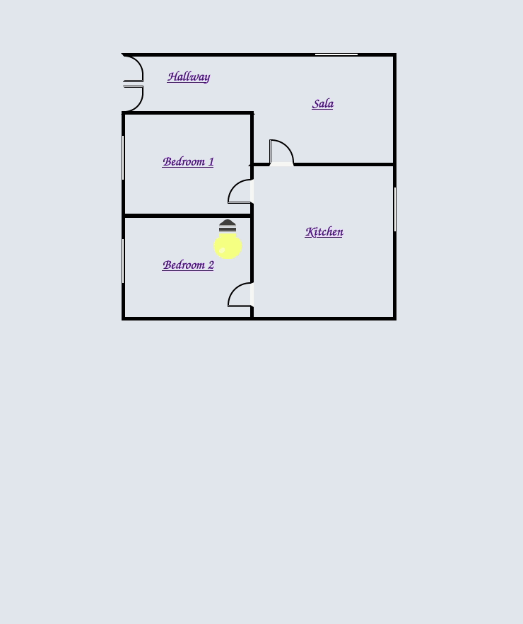

# Light

- [x] Demo use of Phoenix Live View
- [x] Demo use of Live View Components and state management
- [ ] Implement hardware to respond to user controls

# Demo
https://lightdemo.herokuapp.com/

# Start

To start your Phoenix server:

- Install dependencies with `mix deps.get`
- Create and migrate your database with `mix ecto.setup`
- Install Node.js dependencies with `cd assets && npm install`
- Start Phoenix endpoint with `mix phx.server`

Now you can visit [`localhost:4000`](http://localhost:4000) from your browser.
